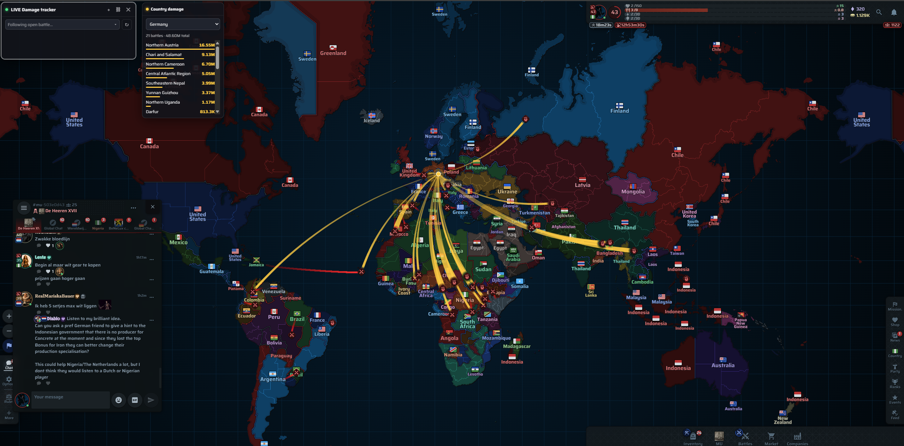
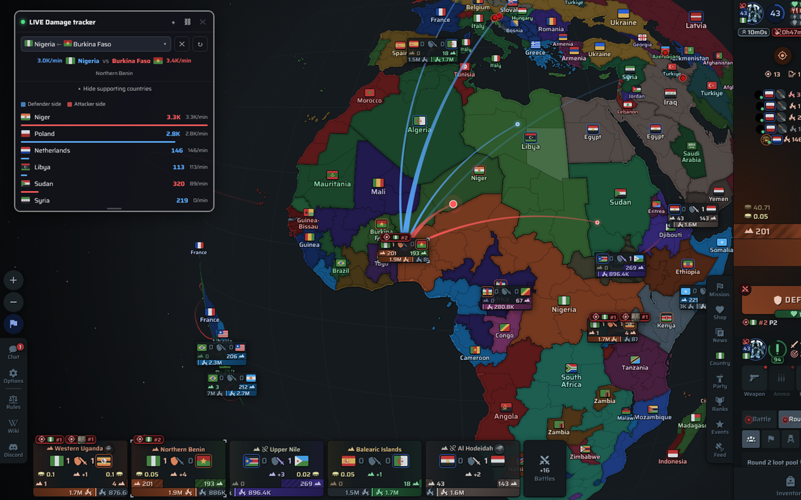

# WarEra Ops

A browser extension (Firefox and Chrome, Manifest V3) that adds extra stats, a live battle damage tracker, and map overlays (bases, bunkers, resistance, core country colors, proxy countries) to the [WarEra](https://app.warera.io) browser game — mostly pulled from WarEra's own public API, with some whitelist-gated features backed by a companion server — styled to match the game's own UI.

## Table of contents

- [Screenshots](#screenshots)
- [Features](#features)
  - [Profile & inventory](#profile--inventory)
  - [Country & MU](#country--mu)
  - [Battles](#battles)
  - [Map](#map)
  - [Extension controls](#extension-controls)
- [Signing in with Discord](#signing-in-with-discord)
- [Installing](#installing)
  - [1. Download it](#1-download-it)
  - [2. Load it in Chrome (or Edge, Brave, and other Chromium browsers)](#2-load-it-in-chrome-or-edge-brave-and-other-chromium-browsers)
  - [3. Load it in Firefox](#3-load-it-in-firefox)

## Screenshots

## Features

### Profile & inventory

- **Profile pages** — extra ranking tiles: Bounty, Cases opened, Elite cases opened, Gems purchased, Health, Hunger. Hover a cases tile for a loot rarity breakdown.
- **Inventory page** — "Export JSON" button next to Craft/Dismantle, for your full items and equipment.

### Country & MU

- **Country pages** — Region Diff and Country Bounty tiles, plus Tax Revenue tiles (whitelist-gated). Shows a "(proxy of X)" badge if the country is currently a proxy (see [Map](#map)).
- **MU pages** — Bounty, # players in buff/debuff, and Invested Money tiles.
- **Country/MU account pages** — total inventory value (money + all items at market price).

### Battles

- **Battle pages** — true total money earned per side, from the full battle ranking rather than just what's scrolled into view.
- **LIVE Damage tracker** — floating window(s) with real-time damage-flow lines per battle, colour-coded and sized by country, plus a K/min timeline. Pick any active battle from a searchable dropdown; open several windows to watch multiple battles at once.
- **Country/MU damage** — a companion window that tracks one country's/MU's damage across every active battle it's involved in, including via allies/mercenaries — Total or Now (since last reset), colour-split by attacker/defender ratio, plus its own timeline.
- **Damage bonuses** — a "Bonuses" button beside each side's own bonus number, showing the Citizens/Allies/Pact/Other breakdown on hover.

### Map

- **Military bases / Bunkers** (whitelist-gated) — marks regions with an active or activating base/bunker, with a live countdown and a toast alert when one lights up.
- **Resistance** (whitelist-gated) — each region's current/max resistance, colour-coded, on the map.
- **Core country colors** — colours regions by their *original* owner instead of whoever currently controls them.
- **Capitals & unlinked regions** — marks each country's capital and any region cut off from its capital with a small icon. Can't be used together with Core country colors.
- **Proxy countries** (whitelist-gated) — flags puppet countries and shows the controlling ("origin") country's flag on the map.
- **Priority lines** - shows the priority + duration & direction of wars between countries

### Extension controls

- **Popup menu** (toolbar icon) — toggle Extra stats, Damage tracker, Country damage, Core country colors, and Proxy countries directly; expand **Map features**, **Battle features**, or **Inventory** for the rest. Sign in with Discord here too, for features that need it.

## Signing in with Discord

A few features need data that isn't in WarEra's own public API, so they're served by a small companion server instead and gated to a Discord whitelist:

- Military base, bunker, and resistance icons on the map
- Daily/Weekly/Monthly Tax Revenue tiles on country pages
- Proxy countries on the map, and the matching "(proxy of X)" badge on country pages

Everything else in this extension (profile/country/MU/battle stats, the damage tracker, country damage, core country colors) works without signing in.

To sign in:

1. Open the popup (click the WarEra Ops icon in your toolbar) and scroll to the bottom.
2. Click **Login with Discord**. A new tab opens to complete the Discord login.
3. If your Discord account is on the whitelist, the popup shows "Logged in as &lt;your name&gt;" and the gated rows (Military bases / Bunkers / Resistance / Proxy countries under Map features, and the tax tiles + proxy badge on country pages) become available.
4. If it isn't, you'll see "That Discord account isn't on the WarEra Ops whitelist." — reach out to **RealMarijn** in-game or on Discord to request access.

Click **Logout** in the popup at any time to sign out again; that immediately revokes the session on the server. See the [Privacy Policy](https://warera.realmarijn.nl/privacy) for exactly what's stored on each side.

## Installing

The extension isn't required to come from a store — you can load it straight from a downloaded copy of this repository.

### 1. Download it

Go to the [GitHub repository](https://github.com/RealMarijn/warera-ops) and either:
- click **Code → Download ZIP** and unzip it somewhere, or
- clone it: `git clone https://github.com/RealMarijn/warera-ops.git`

Either way you should end up with a folder that has `manifest.json` directly inside it — that's the folder you'll point your browser at below.

### 2. Load it in Chrome (or Edge, Brave, and other Chromium browsers)

1. Go to `chrome://extensions`.
2. Turn on **Developer mode** (top-right toggle).
3. Click **Load unpacked** and select the folder from step 1.
4. The WarEra Ops icon appears in your toolbar. Open [app.warera.io](https://app.warera.io) to see it in action.

### 3. Load it in Firefox

Firefox only allows unsigned extensions to be loaded *temporarily* — they're removed on browser restart and need to be reloaded each session.

1. Go to `about:debugging#/runtime/this-firefox`.
2. Click **Load Temporary Add-on…**.
3. Select the `manifest.json` file inside the folder from step 1.
4. The WarEra Ops icon appears in your toolbar. Open [app.warera.io](https://app.warera.io) to see it in action.

If you update the downloaded files later, click **Reload** next to the extension on that same `about:debugging` page (Chrome: the reload icon on `chrome://extensions`) to pick up the changes.
